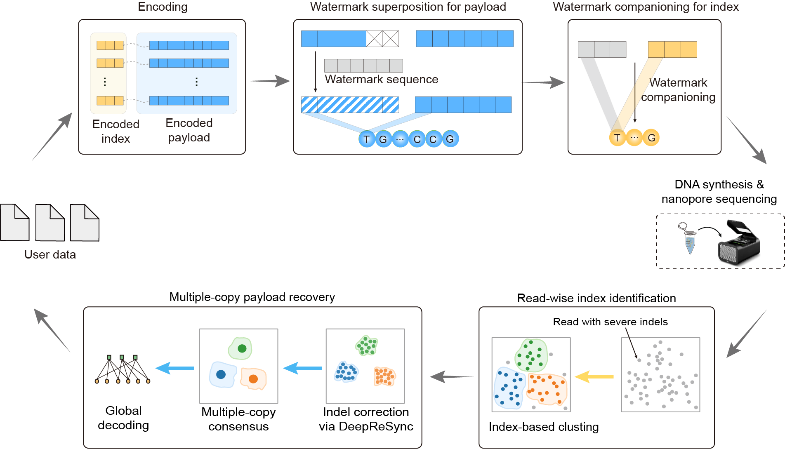

# Direct nanopore readout of DNA data storage using unequal-error-protection oligos

## Table of Contents

- [Direct nanopore readout of DNA data storage using unequal-error-protection oligos](#direct-nanopore-readout-of-dna-data-storage-using-unequal-error-protection-oligos)
  - [Table of Contents](#table-of-contents)
  - [Overview](#overview)
  - [Requirements](#requirements)
  - [Repository Structure](#repository-structure)
  - [Source Data](#source-data)
  - [Usage Example](#usage-example)
  - [Note](#note)
  - [License](#license)

## Overview



Synthetic DNA offers exceptional density and durability for
archival storage, but rapid nanopore readout remains limited by high
insertion and deletion errors. Existing assembly-based strategies reduce
readout errors while adding biochemical complexity. We propose a direct nanopore readout framework that combines unequal-error-protection (UEP) oligos with DeepReSync, a deep learning-based individual-read correction algorithm. In this framework, the index receives a clear watermark for reliable individual-read identification. The payload employs a low-redundancy half-watermark to preserve logical density. During readout, read-wise index identification groups reads. DeepReSync integrates data-driven sequence modeling with half-watermark supervision to produce resynchronized soft information for efficient multiple-copy consensus and global error correction.

The decoding pipeline reconstructs original data from sequencing reads with four main steps:

  **1. Read-wise index identification:** Decode the index region of each read.

  **2. Individual-read correction:** Use DeepReSync to correct indels and estimate payload posteriors.

  **3. Multiple-copy consensus:** Merge indel-corrected copies through soft-information consensus.

  **4. Global error correction:** Perform soft-decision LDPC decoding and recover user data.

The software is implemented in C, C++, and Python, with DeepReSync training and inference implemented in PyTorch. Executable calls are organized into modular shell scripts, enabling easy and flexible deployment across different Linux distributions.

## Requirements

Install the following dependencies on Linux:

- C compiler
- C++ compiler
- Python 3 with PyTorch, NumPy, and tqdm
- PEAR (https://github.com/tseemann/PEAR)
- 7z (https://github.com/ip7z/7zip)

The following open-source C/C++ libraries are used in the software:

- LDPC codes (https://github.com/radfordneal/LDPC-codes, by Radford M. Neal)
- Edlib (https://github.com/Martinsos/edlib, by Martin Šošić)
- Ordered statistics decoding (https://the-art-of-ecc.com/6_Soft/index.html, by Robert H.)

## Repository Structure

```
.
├── configureFiles/             # Watermarks, LDPC matrices, and permutation files
├── figure/                     # Figures used in this README
├── training/                   # DeepReSync model training
│   ├── model/
│   │   └── deepresync.py       # DeepReSync model network
│   ├── runs/checkpoints/       # Checkpoints and training histories
│   ├── utils/
│   │   ├── coding.py           # Half-watermark encoding utilities
│   │   ├── data.py             # PyTorch datasets
│   │   └── simulator.py        # Twist-Nanopore data simulator
│   ├── train.sh                # Default training command
│   └── train_estimator.py      # Training entry point
├── recovery/                   # Readout and data-recovery pipeline
│   ├── bin/                    # Compiled executables
│   ├── include/                # C/C++ headers
│   ├── lib/                    # External decoding libraries
│   ├── reference/              # original_data_files, encoded sequences, and encoded codewords
│   ├── scripts/
│   │   ├── deepresync_infer_posteriors.py
│   │   ├── run_indel_correction.sh
│   │   ├── run_multiple_copy_consensus.sh
│   │   ├── run_posterior_stats.sh
│   │   └── stat_read_posteriors.py
│   ├── src/                    # C/C++ recovery implementations
│   ├── build.sh                # Recovery binary build script
│   └── recovery.sh             # Main recovery entry point
├── sequencing_data/            # Sequencing datasets for recovery test
│   ├── NGS/
│   ├── ONT_HAC/
│   ├── ONT_FAST/
│   └── ONT_SUP/
└── README.md
```

## Source Data

The source data are available on the Sequence Read Archive (SRA) under accession number [PRJNA1505625](https://www.ncbi.nlm.nih.gov/bioproject/PRJNA1505625). Download the FASTQ files to the corresponding subdirectories under sequencing_data. For NGS data, the paired-end reads should be merged with PEAR before data recovery.

1. ONT sequencing data (FAST base calling)
   - UEP_Pool_1_FAST.fastq
   - UEP_Pool_2_FAST.fastq
2. ONT sequencing data (HAC base calling)
   - UEP_Pool_1_HAC.fastq
   - UEP_Pool_2_HAC.fastq
3. ONT sequencing data (SUP base calling)
   - UEP_Pool_1_SUP.fastq
   - UEP_Pool_2_SUP.fastq
4. Illumina sequencing data (PE250)
   - UEP_Pool_1_Illumina_R1/R2.fastq
   - UEP_Pool_2_Illumina_R1/R2.fastq

## Usage Example

### Training

Start DeepReSync training with the default configuration:

```bash
bash training/train.sh
```

### Recovery

For example, recovery/recovery.sh recovers UEP-Pool-1 from ONT FAST reads. Build and run the recovery program as follows:

```bash
bash recovery/build.sh
bash recovery/recovery.sh
```

### Detailed recovery workflow

The recovery workflow is detailed below, including the command, inputs, and outputs for each stage.

#### Preprocessing: Primer identification

**Command:**

```bash
bash "recovery/scripts/run_primer_identification.sh" \
  "$sampled_reads_fastq" "$primer_results_dir" "$THREADS" \
  "$primer_reference_file" "$VALID_BIAS_SIZE" "$PRIMER_MIN_EDIT"
```

**Input files:**

- `sampled_reads_fastq` - sampled sequencing reads
- `primer_reference_file` - known paired primer sequences

**Output files:**

- `primer_trimmed_reads` - primer-trimmed reads (`${primer_results_dir}/valid_reads.fa`)

#### [Step 1] Read-wise index identification

**Command:**

```bash
bash "recovery/scripts/run_index_identification.sh" \
  "$primer_trimmed_reads" "$index_results_dir" "$THREADS" \
  "configureFiles/" "$INDEX_THRESHOLD"
```

**Input files:**

- `primer_trimmed_reads` - primer-trimmed reads from preprocessing
- `configureFiles/watermark_sequence_length_25` - known watermark sequence for the index

**Output files:**

- `index_results_file` - index-identification results (`${index_results_dir}/index_identification_results.txt`), with three columns: read ID, alignment length, and decoded index

#### [Step 2] Individual-read correction

**Command:**

```bash
bash "recovery/scripts/run_indel_correction.sh" \
  "$primer_trimmed_reads" "$index_results_file" \
  "$correction_results_dir" "$pool"
```

**Input files:**

- `primer_trimmed_reads` - primer-trimmed reads from preprocessing
- `index_results_file` - decoded indices from Step 1
- `configureFiles/watermark_sequence_length_235` - known watermark sequence for the payload

**Output files:**

- `read_posteriors_file` - read-wise posterior probabilities from DeepReSync (`${correction_results_dir}/read_posteriors.bin`)

#### [Step 3] Multiple-copy consensus

**Command:**

```bash
bash "recovery/scripts/run_multiple_copy_consensus.sh" \
  "$read_posteriors_file" "$consensus_results_dir" "$pool" "$THREADS"
```

**Input files:**

- `read_posteriors_file` - read-wise posterior probabilities from Step 2

**Output files:**

- `decoding_llr_file` - merged LLR values for decoding (`${consensus_results_dir}/llrs_for_decoding.bin`)

#### [Step 4] Global error correction

**Command:**

```bash
bash "recovery/scripts/run_decoding.sh" \
  "$decoding_llr_file" "$decoding_results_dir" "$pool" "$THREADS"

bash "recovery/scripts/run_recover.sh" \
  "$decoded_bits_file" "$decoding_results_dir" "$pool"
```

**Input files:**

- `decoding_llr_file` - merged LLR values from Step 3
- `configureFiles/sequence_permutation` - permutation applied to the encoded payload
- `configureFiles/sequence_random` - randomization mask used by the LDPC decoder

**Output files:**

- `decoded_bits_file` - decoded bits used to recover user data (`${decoding_results_dir}/src_information.txt`)
- `user_data` - recovered user data

Recovery workflows for UEP-Pool-1 and UEP-Pool-2 under the available ONT and NGS conditions follow the same structure and usage.

## Note

For details of the data simulation, please refer to the following literature:
- D. Bar-Lev, I. Orr, O. Sabary, T. Etzion, E. Yaakobi, Scalable and robust DNA-based storage via coding theory and deep learning. Nat. Mach. Intell. 7, 639–649 (2025).

For the implementation of the forward-backward algorithm, please refer to the following work: 
- J. Haghighat, T. M. Duman, Half-Marker codes for deletion channels with applications in DNA storage. IEEE Commun. Lett. 29, 1639–1643 (2025).

## License

This project is licensed under the MIT License.
